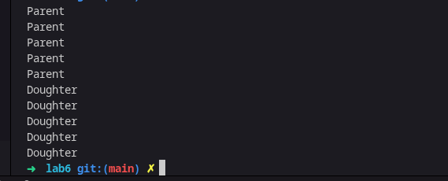
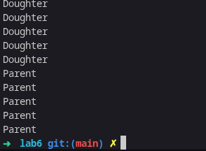
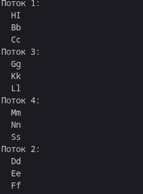
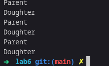
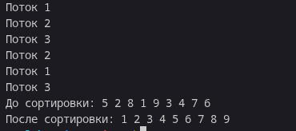

Отчет задания на 3
№1 Родительский и дочерний потоки выводят по 5 строк на экран
 
№2 Сначало строки выводит дочерний потом родительский

№3 Каждый из 4 созданных потоков выводят различные последовательности строк 

№4 Версия первой программы с прерыванием

№5-6 Обработка авершения потока и sleepsort
